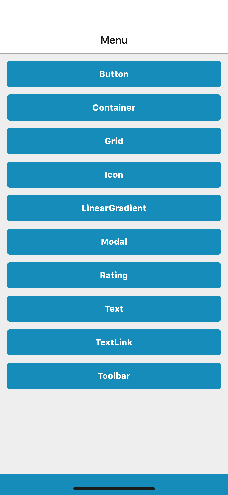

## Props
- `backgroundImage` ([_React Native Image's source_](https://facebook.github.io/react-native/docs/image#source), default null)
- `children` (_node_, **required**)



## Examples

### Default
```jsx
<AppContainer>
    <Container>
        <Text>
            App container
        </Text>
    </Container>
</AppContainer>
```

### Background image
```jsx
<AppContainer backgroundImage={image}>
    <Container>
        <Text>
            App container with a background image
        </Text>
    </Container>
</AppContainer>
```
