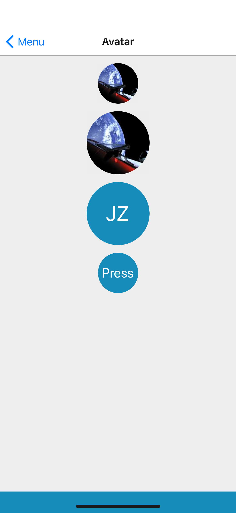

## Props
Extend React Native's [TouchableOpacity](https://facebook.github.io/react-native/docs/touchableopacity#props) props
- `color` (_string_, default null) - one of theme colors, [base theme colors](../Theme.md#colors) by default
- `size` (_number_, default 64)
- `source` (_object_, default null) - React Native's [Image](https://facebook.github.io/react-native/docs/image#props) source
- `text` (_string_, default null)

