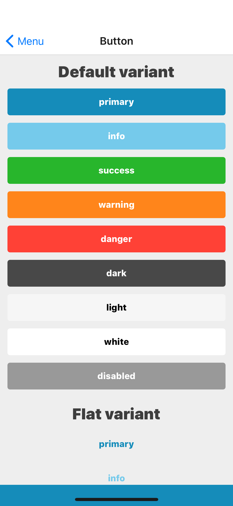
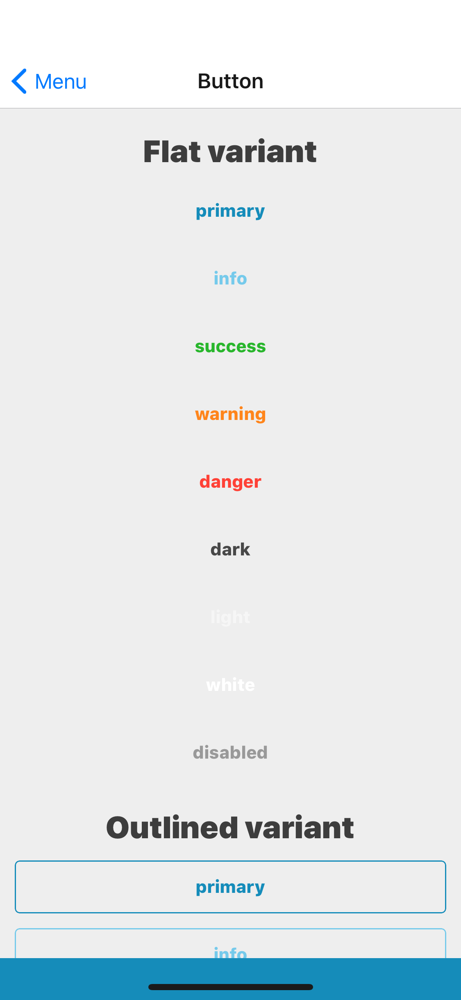
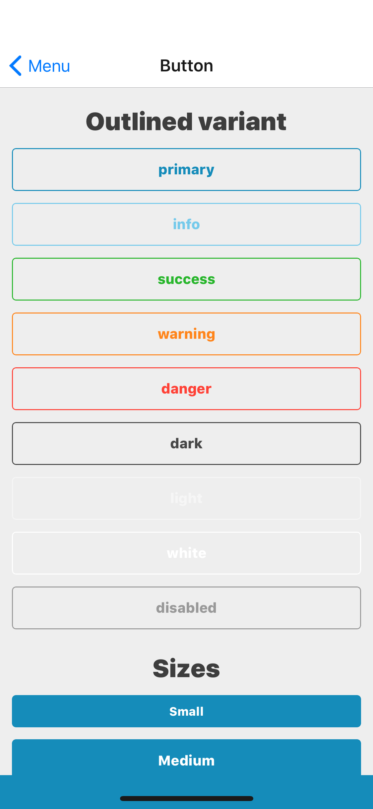
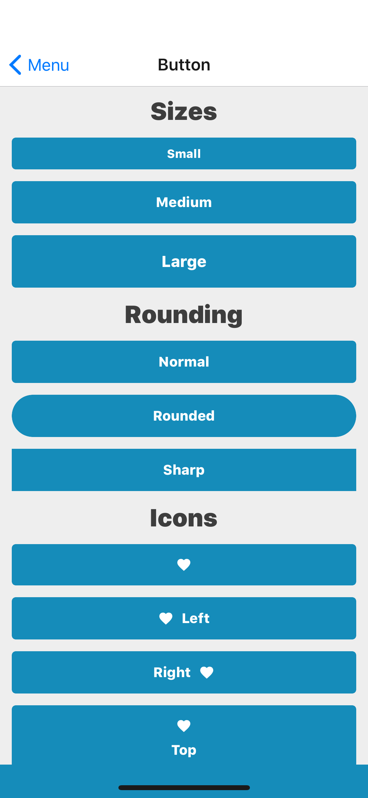
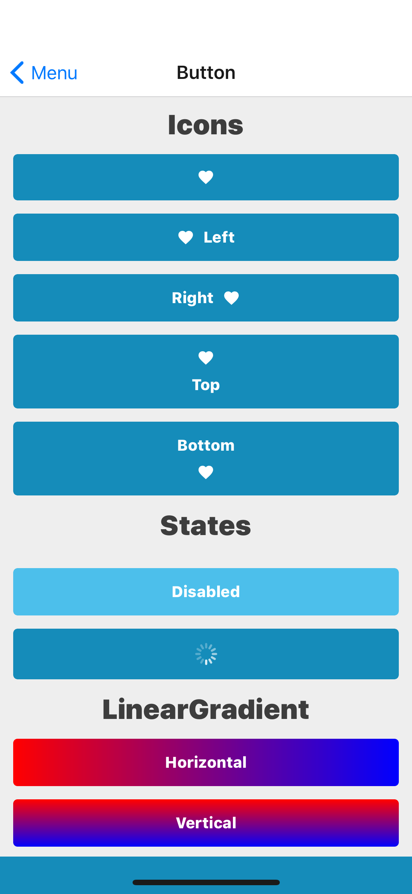

## Props
Extend React Native's [TouchableOpacity](https://facebook.github.io/react-native/docs/touchableopacity#props) props
- `color` (_string_, default primary) - one of theme colors, [base theme colors](../Theme.md#colors) by default
- `disabled` (_boolean_, default false)
- `icon` (_object_, default null)
    - [`Icon` props](Icon.md#props)
    - `position` (_string_, default left, only matters if a `text` is set)
- `linearGradient` (_object_, default null)
    - [`LinearGradient` props](LinearGradient.md#props) except `height` and `width` which are calculated automatically based on a container
- `loading` (_boolean_, default false)
- `rounding` (_string_, default normal)
- `size` (_string_, default medium) - one of theme spacing, [base theme spacing](../Theme.md#spacing) by default
- `text` (_string_, default null)
- `variant` (_string_, default default)







## How do styles work
The styles are merged in this order: base, rounding, size, color, variant and iconPosition. It means basic styles
are applied, then rounded borders, then then the button is resized, then the button gets its colors - the color is
applied for both background and text. Then variant decides if the color should be applied for background only
(default variant), for text only (flat variant) or for text and border (outlined variant). Then iconPosition decides
which flexDirection and padding should be applied to container and iconContainer.

## Examples

### Default

```jsx
<Button
    text="With text"
/>
```

```jsx
<Button
    icon={{
        name: 'star',
    }}
/>
```

### Color

```jsx
<Button
    color="success"
    text="With different color"
/>
```

### Icon

```jsx
<Button
    icon={{
        name: 'star',
    }}
    text="With icon"
/>
```

```jsx
<Button
    icon={{
        name: 'star',
        position: 'right',
    }}
    text="With icon on right"
/>
```

### Rounding

```jsx
<Button
    rounding="rounded"
    text="Rounded"
/>
```

```jsx
<Button
    rounding="sharp"
    text="Sharp"
/>
```

### Size

```jsx
<Button
    size="small"
    text="Small"
/>
```

```jsx
<Button
    size="large"
    text="Large"
/>
```

### Variant

```jsx
<Button
    text="Flat"
    variant="flat"
/>
```

```jsx
<Button
    text="Outlined"
    variant="outlined"
/>
```

### States

```jsx
<Button
    disabled
    text="Disabled"
/>
```

```jsx
<Button
    loading
/>
```
