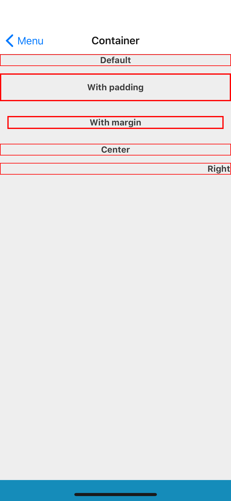

## Props
Extend React Native's [View](https://facebook.github.io/react-native/docs/view#props) props
- `alignment` (_string_, default null)
- `marginSize` (_string_, default null) - one of theme sizes, [base theme spacing](../Theme.md#spacing) by default
- `paddingSize` (_string_, default null) - one of theme sizes, [base theme spacing](../Theme.md#spacing) by default



## Examples

### Default
```jsx
<Container>
    <Text>
        Default container
    </Text>
</Container>
```

### Alignment
```jsx
<Container alignment="center">
    <Text>
        Container with centered content
    </Text>
</Container>
```
