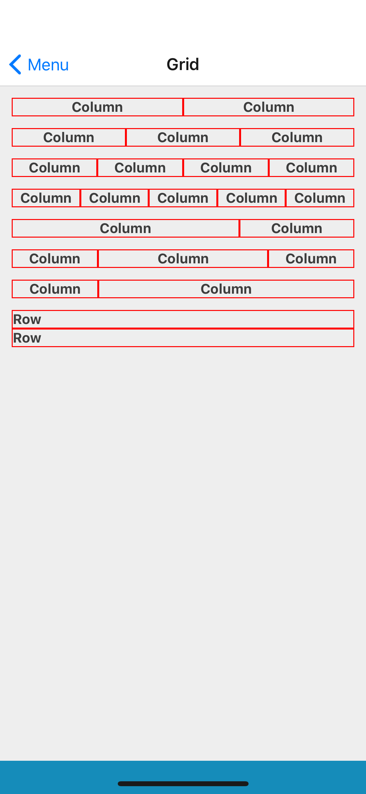

## Grid
### Props
Extend React Native's [View](https://facebook.github.io/react-native/docs/view#props) props

## Column
### Props
Extend React Native's [View](https://facebook.github.io/react-native/docs/view#props) props
- `size` (_number_,  default null)

## Row
### Props
Extend React Native's [View](https://facebook.github.io/react-native/docs/view#props) props
- `size` (_number_, default null)



## Examples

```jsx
<Grid>
    <Column>
        <Text>
            Column
        </Text>
    </Column>
    <Column>
        <Text>
            Column
        </Text>
    </Column>
</Grid>
```
