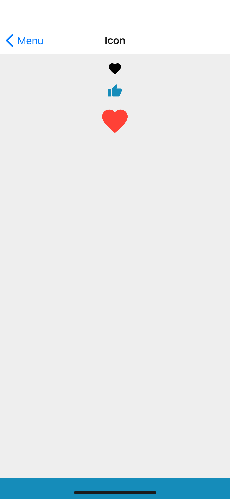

## Props
- `color` (_string_, default null)
- `colorName` (_string_, default null) - one of theme colors, [base theme colors](../Theme.md#colors) by default
- `iconSet` (_string_, default `theme.typography.iconSet` which is MaterialIcons by default)
- `name` (_string_, **required**)
- `size` (_number_, default 24)

