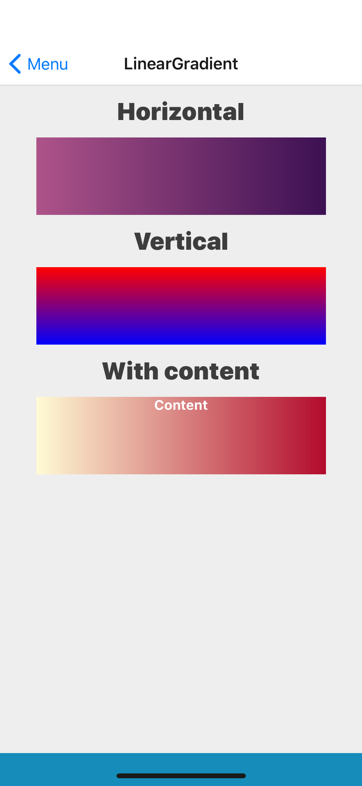

## Props
Extend React Native's [View](https://facebook.github.io/react-native/docs/view#props) props
- `children` (_node_, default null)
- `fromColor` (_string_, **required**)
- `gradientDirection` (_string_, default horizontal)
- `height` (_number_, **required**)
- `toColor` (_string_, **required**)
- `width` (_number_, **required**)

