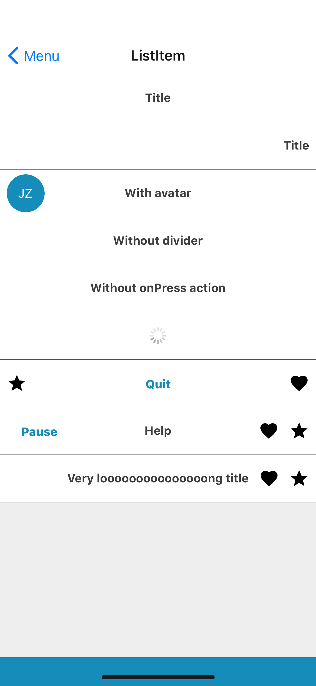

## Props
- `centerElement` (_node_, default null)
- `centerElementSize` (_number_, default 1.5)
- `color` (_string_, default white) - one of theme colors, [base theme colors](../Theme.md#colors) by default
- `divider` (_boolean_, default true)
- `leftElement` (_node_, default null)
- `leftElementSize` (_number_, default 1)
- `loading` (_boolean_, default true)
- `rightElement` (_node_, default null)
- `rightElementSize` (_number_, default 1)

