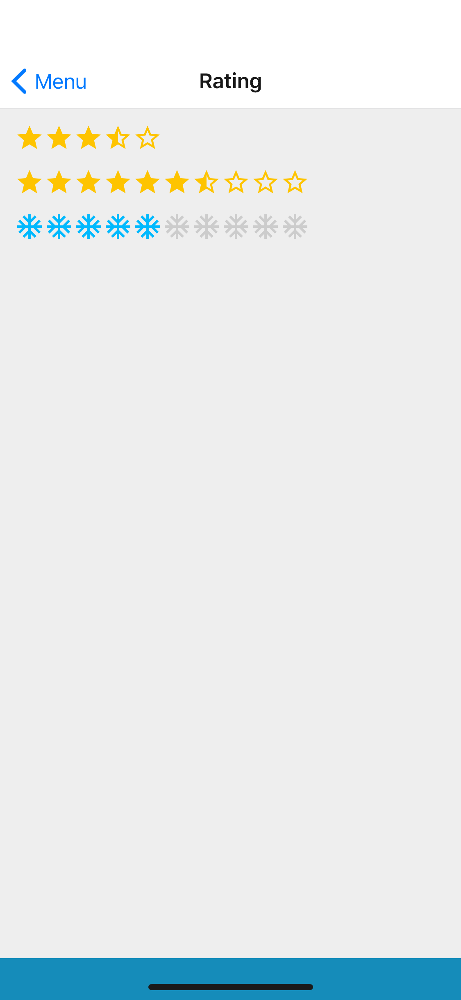

## Props
- `emptyIcon` (_object_, **required**)
    - [`Icon` props](Icon.md#props)
- `fullIcon` (_object_, **required**)
    - [`Icon` props](Icon.md#props)
- `halfIcon` (_object_, **required**)
    - [`Icon` props](Icon.md#props)
- `limit` (_number_, default 5)
- `onPress` (_function_, default null)
- `rating` (_number_, **required**)

