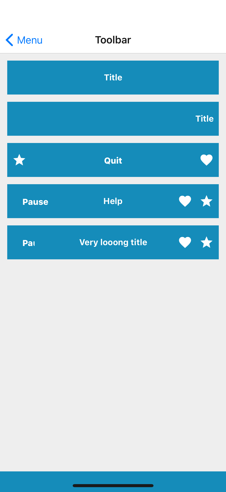

## Props
- `centerElement` (_node_, default null)
- `centerElementAlignment` (_string_, default center)
- `centerElementSize` (_number_, default 1)
- `color` (_string_, default primary) - one of theme colors, [base theme colors](../Theme.md#colors) by default
- `leftElement` (_node_, default null)
- `leftElementAlignment` (_string_, default left)
- `leftElementSize` (_number_, default 0)
- `rightElement` (_node_, default null)
- `rightElementAlignment` (_string_, default right)
- `rightElementSize` (_number_, default 0)

